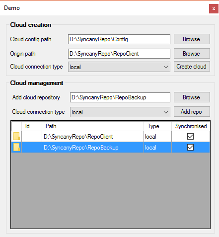

# Droid-Deployer
Allow to install and control an informatic solution with tools :
 - Syncany
 - Docker (dev in progress)
 - Github
 - Jenkins
 - Jira
 - Sonar
 - Team city

# Example in demo for Syncany cloud interface

```csharp
 Application.Run(new Droid_deployer.DemoSyncany());
```
<center></center>
